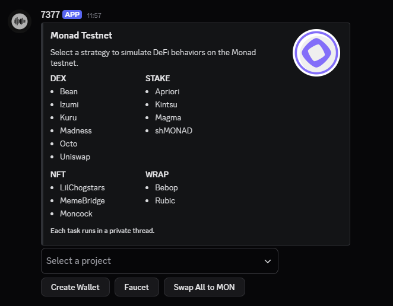

<h1 align="center">
  <a href="https://github.com/jevenchy"></a>
</h1>

<p align="center">Discord automation bot for Monad testnet. Supports staking, unstaking, wrapping, unwrapping, minting, and swapping modules.</p>

<p align="center">
  <a href="https://nodejs.org/">
    
  </a>
  <a href="https://github.com/jevenchy/monad-testnet/stargazers">
    
  </a>
  <a href="https://github.com/jevenchy/monad-testnet/network/members">
    
  </a>
  <a href="https://github.com/jevenchy/monad-testnet/issues">
    
  </a>
  <a href="https://github.com/jevenchy/monad-testnet/graphs/contributors">
    
  </a>
  <a href="https://github.com/jevenchy">
    
  </a>
</p>

## Overview

Modular automation bot built for Monad testnet — fully integrated with Discord. It simulates DeFi strategies like staking, unstaking, wrapping, unwrapping, minting, and swapping across multiple protocols. Interactions are handled through dropdown and modal components, with each strategy running in a private thread tied to its respective wallet.

Execution is randomized, retry-aware, and cycle-driven. Each module is isolated, making the system robust, scalable, and production-ready for testnet farming or strategy simulation.

## Features



- Modular: Each module runs in an isolated private thread
- Per-wallet execution: simulates DeFi actions in an isolated context
- Retry-safe: handles nonce errors, underpriced gas, rate limits, and replaced transactions
- Built-in delay: randomizes time between actions in each cycle
- Gas presets per op type (stake, swap, wrap, etc)
- Raw TX info decode (enable via `rawInfo = true`)
- Each project runs via `dynamicRunner()` from map

Supported modules:

- STAKE: `apriori`, `magma`, `shmonad`, `kintsu`
- WRAP: `bebop`, `rubic`
- DEX: `bean`, `uniswap`, `izumi`, `kuru`, `madness`, `octo`
- NFT: `lilChogstars`, `memeBridge`, `moncock` (FREE MINT)

> [!IMPORTANT]  
> Left it here in case it helps — a ⭐️ tells me it did.

Have ideas, suggestions, or improvements?  
Feel free to open an [issue](https://github.com/jevenchy/monad-testnet/issues) or start a [discussion](https://github.com/jevenchy/monad-testnet/discussions)

## Setup

```
npm install
cp env.example .env
```

Edit `.env` file:

```
DISCORD_TOKEN=your_token_here
GUILD_ID=...
EMBED_CHANNEL_ID=...
```

Start bot:

```
npm start
```

## File Structure

```
monad/
├── config/               # Configuration token, contracts, presets
├── img/                  # Assets (avatar, embed)
└── src/
    ├── ABI/              # Per-project ABIs
    ├── embed/            # Embed builder
    ├── events/           # Discord event listeners
    ├── modules/          # Logic per project
    └── utils/            # Wallet init, delay, error handler, etc
```

## Configuration Format (config.js)

The `config.js` file governs all runtime behavior — including randomized delays, gas strategies per operation, retry thresholds, execution cycles, and explorer integration. It is structured for fail-safe execution under testnet conditions.

```
export const config = {
  rpc: 'https://testnet-rpc.monad.xyz/',
  explorer: 'https://testnet.monadexplorer.com/tx/',

  cycle: 1,
  retry: 3,
  rawInfo: true,
  randomDelay,
  tokens,

  gas: {
    stake: [200000, 300000, 400000],
    unstake: [200000, 300000, 400000],
    claim: [200000, 300000, 400000],
    wrap: [200000, 300000, 400000],
    unwrap: [200000, 300000, 400000],
    mint: [200000, 300000, 400000],
    swap: [200000, 300000, 400000]
  },

  delay: {
    min: 10,
    max: 20
  },

  amount: {
    min: 0.001,
    max: 0.003
  }
}
```

- `rpc`: target JSON-RPC endpoint
- `explorer`: base URL for tx hashes
- `cycle`: number of cycles per module
- `retry`: max retries per transaction
- `gas`: gas limit presets per action type
- `delay`: randomized wait range (in seconds)
- `amount`: range of randomized amount (MON)

## Contract Mapping (contracts.js)

This file maps protocol names to contract or router addresses and their execution types.

```
{
  apriori: {
    name: 'Apriori',
    contract: '0x...',
    type: 'stake'
  },
  bean: {
    name: 'Bean',
    router: '0x...',
    type: 'dex'
  }
}
```

Supported `type`: `stake`, `dex`, `wrap`, etc

## Requirements

- Node.js ≥ 18
- Discord bot with permissions
- MON testnet wallet(s) with balance

## Contributing

Pull requests welcome — just follow the existing module pattern.
If you have a module idea, improvement, or bug fix:

- Submit an [issue](https://github.com/jevenchy/monad-testnet/issues)  
- Open a [discussion](https://github.com/jevenchy/monad-testnet/discussions)
- Fork this repo and open a PR!

Every contribution counts.